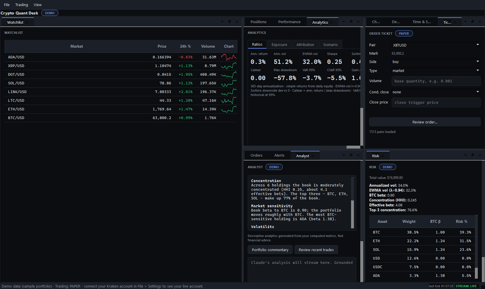
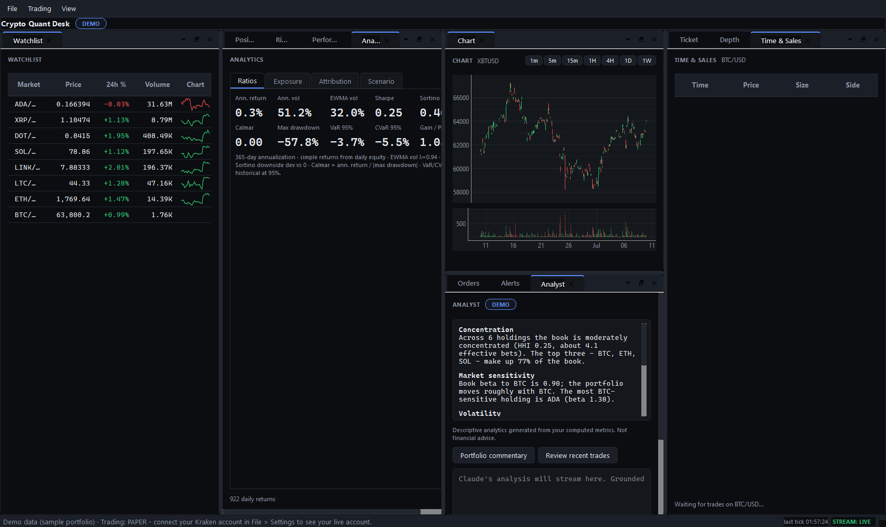
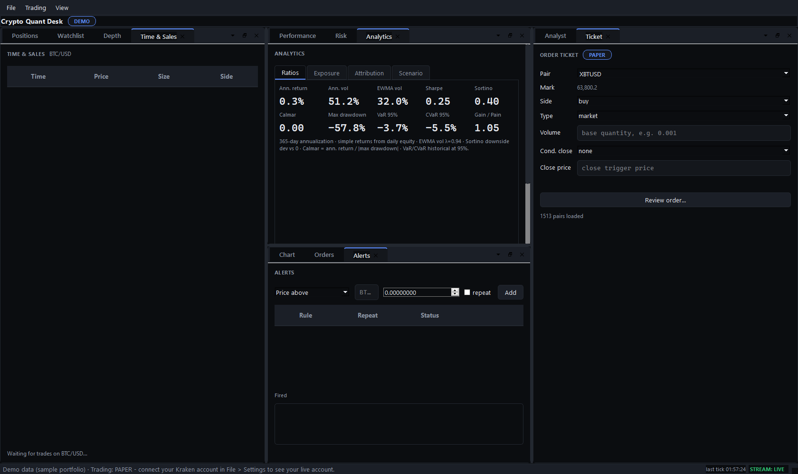

# Crypto Quant Desk

A cross-platform (Windows & macOS) desktop dashboard and trading terminal for a
Kraken spot account: an adjustable card workspace with live positions and true
cost basis, portfolio-level risk (volatility, BTC beta, concentration, risk
contribution, tail metrics), Bloomberg-style analytics, real-time charts and
market microstructure, and a full order suite with hard safety rails. A
Claude-powered analyst panel narrates the numbers; the math engine computes them.

Personal-use software, MIT-licensed. It talks to Kraken's official APIs and
nothing else: no third-party price feeds, no telemetry, and your API keys never
leave your machine (they live in your OS keychain — Windows Credential Manager or
macOS Keychain — not on disk).



## Status

**v2.0.0** — the core desk is feature-complete: adjustable workspace, live
trading with rails, streaming market data, the analytics suite, and the AI
analyst. Runs on Windows and macOS; a per-user Windows installer is built from
[`packaging/windows/`](packaging/windows/) and a macOS `.app`/`.dmg` from
[`packaging/`](packaging/). The canonical spec lives in
[`docs/`](docs/) (PRD, app flow, tech stack, frontend guidelines, backend
structure, implementation plan); session state is tracked in
[`progress.txt`](progress.txt).

## What it does

- **Adjustable workspace** — every panel is a card you can float, tab, split, and
  resize; three saved perspectives (Trading / Analysis / Monitor) and a reset,
  with your layout persisted between sessions
- **Positions** — live holdings, mark price, USD value, average cost,
  break-even, unrealized PnL (cost basis labeled per quote currency)
- **Risk** — annualized and EWMA volatility, BTC beta, HHI, effective bets,
  per-asset risk contribution, VaR/CVaR, with every assumption footnoted
- **Analytics** — ratios (Sharpe, Sortino, Calmar, rolling), exposure
  (correlation heatmap, concentration, sector map), attribution (per-asset
  realized PnL, monthly-returns heatmap, BTC benchmark), and scenario stress
  (drawdown, BTC shocks, Monte Carlo NAV fan)
- **Charts & microstructure** — candlestick chart with volume and selectable
  timeframes, a cumulative-depth order book, a live Time & Sales tape, and a
  watchlist; one active-symbol bus keeps them in sync
- **Trading** — market/limit/stop/take-profit/trailing orders with a
  confirmation dialog, a paper-mode default, a max-order-value cap, and an
  append-only local audit log; open-orders management; live order state via
  WebSocket
- **Performance** — equity curve, realized/unrealized PnL history, drawdown,
  per-position stats, trade expectancy
- **Alerts** — price/PnL/risk rules with native OS notifications (Windows toasts,
  macOS Notification Center)
- **Analyst** — rules-based narration for free; optional Claude analysis (your
  own Anthropic key, `claude-opus-4-8`) with portfolio commentary, trade review,
  and free-text Q&A, streamed and priced per call. It narrates engine output and
  never invents numbers

## Screenshots

The workspace ships three saved perspectives (all shown here on demo data).

**Trading** — watchlist, live chart, analytics, and the AI analyst:



**Analysis** — full ratio panel, order ticket, and alerts:



## Safety model

- Paper mode is the default; going live requires an explicit, typed confirmation
- Every order passes validation, a size cap, and a confirmation dialog
- Every order attempt is audit-logged locally
- Kraken API keys need only query + trade permissions. **Never enable
  Withdraw Funds** — the app has no withdrawal code path and never will

## Install

- **Windows** — download `crypto-quant-desk-2.0.0-setup.exe` or build it from
  source. Per-user install (no admin), Start-menu shortcut, clean uninstall that
  preserves your data and keys.
- **macOS** — download the `.dmg` or build the `.app` from source, then drag it to
  Applications. It is unsigned, so approve it once on first launch (right-click →
  Open).

Build steps for both are in [`packaging/README.md`](packaging/README.md).

First launch opens in demo mode (synthetic portfolio, real market data). Connect
your own account via **File > Settings** with a Kraken API key created at
https://www.kraken.com/u/security/api (permissions: Query Funds, Query Open/
Closed Orders & Trades, Query Ledger Entries, Create & Modify Orders — **never**
Withdraw). Optionally add an Anthropic key there to enable the AI analyst.

## Quick start (dev)

Requires Python 3.11+. On macOS/Linux use `python3` and `source .venv/bin/activate`.

```bash
git clone https://github.com/ccharafeddine/crypto-quant-desk.git
cd crypto-quant-desk

python -m venv .venv
.venv\Scripts\activate          # Windows;  source .venv/bin/activate on macOS
pip install -e ".[dev]"

python -m cqd
```

## Architecture

```
src/cqd/
├── engine/     # pure math: risk, metrics, cost basis, performance (no I/O)
├── data/       # Kraken REST + WebSocket clients, normalizer, credentials
├── trading/    # order service, paper broker, limits, audit log
├── alerts/     # rule engine + native OS notifications (Windows/macOS)
├── analyst/    # rules narration + optional Claude integration (grounded, priced)
└── ui/         # PySide6 QtAds card workspace, dockable panels, token-driven themes
```

Design rules: the engine is pure functions (fully tested, no I/O/Qt/network);
all market and portfolio data comes from Kraken's official APIs; every
order flows through one service with non-bypassable rails; no database —
settings, JSON state, and the OS credential vault.

## Development

```powershell
pytest -q                 # tests
ruff check src tests      # lint
ruff format src tests     # format
```

## License

MIT. See `LICENSE`.

## Disclaimer

Experimental software that can place real orders on your live Kraken account
when you enable live mode with trade-permissioned keys. Use at your own risk.
The authors accept no liability for financial losses.
